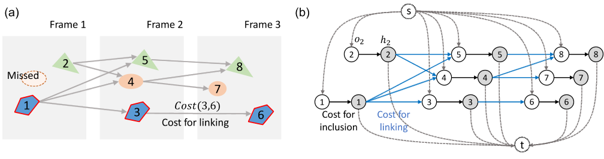
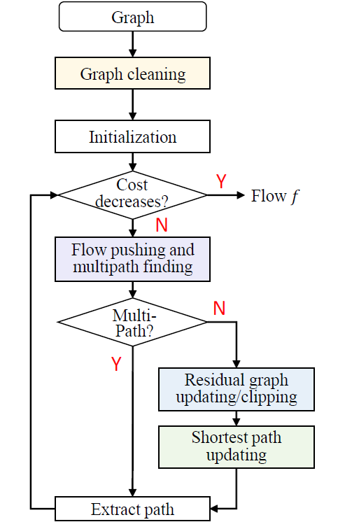
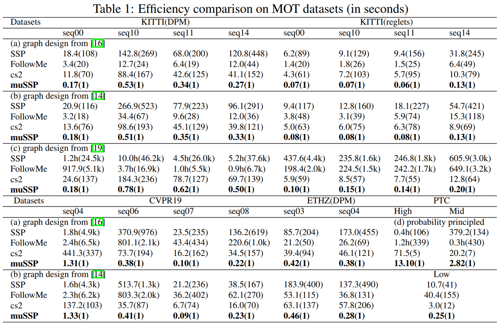
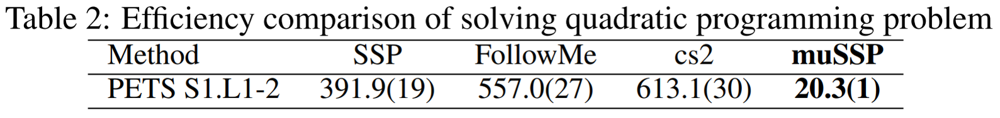

# Welcome to muSSP
muSSP (**M**inimum-**u**pdate **S**uccessive **S**hortest **P**ath) is an exact and efficient min-cost flow (MCF) solver for the global data association problem in multi-object tracking (MOT). MCF has been widely used for solving data-association problem in MOT, while existing solvers for MCF problem in MOT are either directly adoption or slight modifications of generic MCF algorithms, yielding sub-optimal efficiency. Based on successive shortest path (SSP) algorithm, muSSP identifies several specialties of the MCF problem in MOT and saves dramatic computation by leveraging these specialties. Practically, muSSP got **hundreds to thousands efficiency improvement** compared with peer methods tested on five MOT benchmarks. muSSP enjoys the same worst-case complexity and space efficiency as SSP. The improved computational efficiency is expected to enable more sophisticated tracking framework and yields better tracking accuracy.

- [Overview of the MCF problem in MOT](#overview-of-the-MCF-problem-in-MOT)
  - [What is MCF doing in MOT?](#What-is-MCF-doing-in-MOT?)
  - [Specialties of the network](#Specialties-of-the-network)
  - [Successive shortest path (SSP) algorithm](#Successive-shortest-path-(SSP)-algorithm)
  - [Minimum-update Successive Shortest Path (muSSP) algorithm](#Minimum-update-Successive-Shortest-Path-(muSSP)-algorithm)
- [Why is muSSP faster?](#Why-is-muSSP-faster?)
- [Experiments](#Experiments)
  - [muSSP is averagely hundreds to thousands times faster than peer methods](#muSSP-is-averagely-hundreds-to-thousands-times-faster-than-peer-methods)
  - [Consistent performance is achieved when applying muSSP to higher-order model](#Consistent-performance-is-achieved-when-applying-muSSP-to-higher-order-model)
- [How to use muSSP?](#How-to-use-muSSP?)
  - [To run the codes with provided sample graph](#To-run-the-codes-with-provided-sample-graph)
  - [To rebuild for you own graph](#To-rebuild-for-you-own-graph)
- [Citation](#citation)
- [References](#references)
- [Updates](#updates)
## Overview of the MCF problem in MOT
<p align="center">
  
  
 (a) Objects detected in three frames. The first frame has two detections and misses one.
Lines between detections are possible ways of linking them. Each line is associated with a cost.
Detections 1, 3 and 6 should be linked together as a single trajectory. (b) Typical min-cost flow model for MOT problem. Detection i is represented by a pair of nodes: a pre-node o_i and a post-node h_i (e.g. see detection 2). The source node **s** is linked to all pre-nodes and all post-nodes are linked to the sink node **t**. These edges are shown in dashed lines. Edges between detections are shown in blue.
</p>

More details can be found in our [NeurIPS paper](https://drive.google.com/file/d/1BUkWpkX-QagNY5vxP0H_QuyIIFbfMtfK/view?usp=sharing) and [poster](https://drive.google.com/file/d/1sVkRwuPQNmRLfbMt45-ylnA4YeqKjOLD/view).

Inspired by the min-cost flow based data-association framework, we developped a new data-association framework based on min-cost circulation called [CINDA](https://github.com/yu-lab-vt/CINDA), which maintains the same optimal solution as the min-cost flow framework. A theoretically and practically adavanced implementation of CINDA is also provided.

### What is MCF doing in MOT?
* Select a set of s-t paths with minimal total cost.
* Each path is a trajectory.

### Specialties of the network
1. Directed acyclic graph, with single source node s and single sink node t
2. Unit-capacity graph
3. Each detection corresponds to a pair of nodes, a pre-node and a post-node, with a single arc linking them
4. Each pre-node is linked from s and each post-node is linked to t

### Successive shortest path (SSP) algorithm 
Sequentially instantiate the shortest s-t path on the residual graph and augment flow on it until it is saturated.

### Minimum-update Successive Shortest Path (muSSP) algorithm
Dynamically maintain a shortest path tree of the residual graph while avoid computation that unrelated to finding the shortest s-t path.

## Why is muSSP faster?
1. Increase the reusability of the shortest path tree
2. Reduce the update frequency of the shortest path tree
3. Accelerate the updating of the shortest path tree

Four strategies (the four modules with different colors in the following flowchart) were proposed in muSSP to fulfill these three tasks. None of the strategies violate the optimality of the final solution. Details of the strategies and their proofs can be found in our [paper](https://drive.google.com/file/d/1BUkWpkX-QagNY5vxP0H_QuyIIFbfMtfK/view?usp=sharing).
<p align="center">
  
</p>

## Experiments
### muSSP is averagely hundreds to thousands times faster than peer methods
<p align="center">
  

SSP is shown in [4] and [5] to enjoy a low theoretical complexity if the number of objects is small.
FollowMe [2] proposed an improved version of SSP for MOT problem.
cs2[1] is a famous push-relabel based MCF solver used in [3] and [4], where binary search was needed when applying to MOT.
</p>

### Consistent performance is achieved when applying muSSP to higher-order model
<p align="center">
  
</p>

## How to use muSSP?

### To run the codes with provided sample graph
```
(1). cd to the file location (e.g. 'you path to/SrcCode/muSSP/')
(2). open terminal under current location
(3). run the command in terminal: './muSSP ../input_MOT_seq07_followme.txt'
```
The same way can be used to run dSSP algorithm in FollowMe and SSP algorithm

### To rebuild for you own graph
```
(1) add the basic information like number of nodes and arcs to the file head
(2) set the src node, sink node. In our tests, we use 1 and n
(3) add arcs indicating the enter/exit and transition cost of a detection
(4) add other arcs indicating the cost of linking two objects into one trajectory
```

The packages are tested on Ubunut 16.04, the code is compiled by g++ and gcc v9.3.0.
The sample graph format follows DIMACS CNF format, but does not list arc capacity constraint, which is always [0,1].

## Citation
If you find the code useful for your research, please cite our paper.
```
@inproceedings{wang2019mussp,
  title={muSSP: Efficient Min-cost Flow Algorithm for Multi-object Tracking},
  author={Wang, Congchao and Wang, Yizhi and Wang, Yinxue and Wu, Chiung-Ting and Yu, Guoqiang},
  booktitle={Advances in Neural Information Processing Systems},
  pages={423--432},
  year={2019}
}
```
## References
[1] Goldberg, A. V. (1997). An efficient implementation of a scaling minimum-cost flow algorithm. Journal of algorithms, 22(1), 1-29. [cs2]

[2] Philip Lenz, Andreas Geiger, and Raquel Urtasun. Followme: Efficient online min-cost flowtracking with bounded memory and computation.  InProceedings of the IEEE InternationalConference on Computer Vision, pages 4364–4372, 2015. [FollowMe]

[3] L. Zhang, Y. Li, and R. Nevatia, “Global data association for multiobject tracking using network flows,” in 2008 IEEE Conference on Computer Vision and Pattern Recognition. IEEE, 2008, pp. 1–8. 

[4] H. Pirsiavash, D. Ramanan, and C. C. Fowlkes, “Globally-optimal
greedy algorithms for tracking a variable number of objects,” in 2008 IEEE Conference on Computer Vision and Pattern Recognition. IEEE, 2011, pp. 1201–1208.

[5] J. Berclaz, F. Fleuret, E. Turetken, and P. Fua, “Multiple object
tracking using k-shortest paths optimization,” IEEE transactions
on pattern analysis and machine intelligence, vol. 33, no. 9, pp. 1806–
1819, 2011.

## Updates
### 01/13/2021:
Apache-2.0 License was added.

### 06/12/2020:

1) Integrate the code refinement from Nuzhny007, fixing the memory leaks.
2) Change the command for running muSSP/dSSP/SSP (Remove "-i").
3) Fix the bug caused by 'abs' function under C++14 standard.
4) Update the codes with c++14 standard and test it with g++/gcc v9.3.0.


